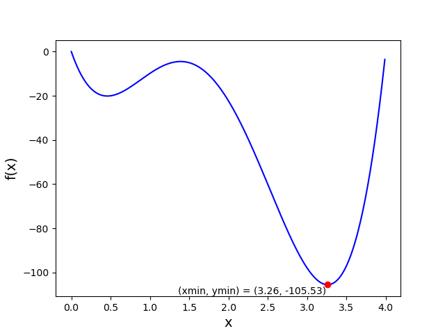

# Plot

Write a program that shows the following graph.

## Specification

* Create a file called `plot.py` and implement a program that plots a graph of the function $$f(x) = y = 12.38 \cdot x^4 - 84.38 \cdot x^3 + 165.19 \cdot x^2 - 103.05 * x$$ between $$x=0$$ and $$x=1.5$$ with steps of $$0.01$$. Use a blue line for this graph.

* The minimum of the function has to be calculated. Since you have a list of x-values and a list of y-values, you can easily achieve this with a `for`-loop. Write your own algorithm without using the Python functions `min()` or `max()`.

* You can use the math library and, of course, matplotlib.

* Indicate the minimum of the graph by using a red dot and a text within the graph.

* Use `print` to also display the minimum as text in the terminal, in addition to the text in the graph. The minimum should be printed in the format: `(xmin, ymin) = (3.26, -105.53)`.

## Hints

* Before plotting, create two lists with correct x- and y-values each.

* Closely examine [the examples](/python/en/plotting).

* Getting the x coordinate of the minimum without using `min()` can only be done by getting the index of the y-value that is the lowest! It should be easier to get this index with a for-loop that iterates over indexes (`for i in range(...):`) than by using a for-loop that iterates over items (`for y in y_values:`). For more information, look at [this page](/python/en/loops/element-vs-index).

* You can use `round()` to round a floating point number to a number of decimals. `round(3.14159265359, 2)` for example, will round the number `3.14159265359` to two decimals: `3.14`.

* When using external libraries it can be very useful to make proper use of Google. Want to know how a certain feature can be achieved in pyplot? Google it! Tip: use the word "example" in your search query.

* To use `matplotlib` you have to import it at the top of your program:

		import matplotlib.pyplot as plt

* **Note:** To use `matplotlib` in the **online IDE** (in your browser), you'll need a few extra lines of code:

		import matplotlib
		matplotlib.use('Agg')
		import matplotlib.pyplot as plt

* Also remember that `^` in Python does not result in exponentiation. Use `**` to correctly calculate a number raised to a power.

* Can't seem to get the plotting to function properly? Send us a mail!

## Testing

Testing for this assignment is somewhat more difficult, because checkpy cannot judge whether your graph complies with the specification. Whether it is correct or not is for you to determine. Checkpy can, however, test if you've created a graph at all.

    checkpy plot
