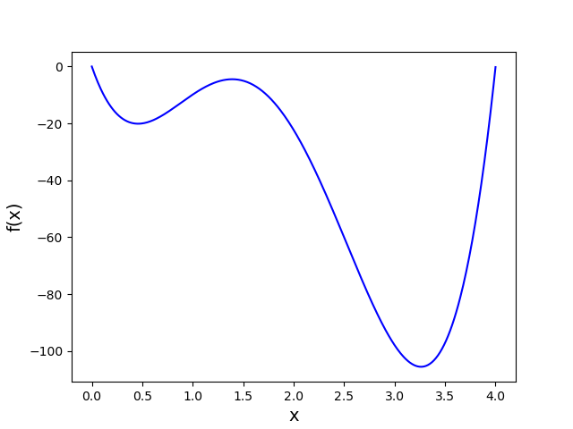

# Plot

Write a program called `plot1.py` that shows the following graph:

You should use functions for this assignment but we do not specify which. It is up to you to figure out what the best way is to use functions for this assignment. Note that there is not one correct way.

## Specification

* Make sure the program plots a graph of the function $$f(x) = y = 12.38 \cdot x^4 - 84.38 \cdot x^3 + 165.19 \cdot x^2 - 103.05 \cdot x$$ between $$x=0$$ and $$x=4$$ with steps of $$0.01$$. Use a blue line for this graph.

* In order to create the plot, create a list of x-values and a list of corresponding y-values (named `x_values` and `y_values`). You might want to re-use the `arange()` function you've created before.

## Constraints

* You can import the math library and, of course, matplotlib.

* You **cannot** import any other library.

## Hints

* Before plotting, create two lists with correct x- and y-values each.

* Closely examine [the examples](/python/en/plotting).

* When using external libraries it can be very useful to make proper use of Google. Want to know how a certain feature can be achieved in pyplot? Google it! Tip: use the word "example" in your search query.

* To use `matplotlib` you have to import it at the top of your program:

		import matplotlib.pyplot as plt

* Also remember that `^` in Python does not result in exponentiation. Use `**` to correctly calculate a number raised to a power.

## Testing

Testing for this assignment is somewhat more difficult, because checkpy cannot judge whether your graph complies with the specification. Whether it is correct or not is for you to determine. Checkpy can, however, test if you've created a graph at all.

    checkpy plot1
