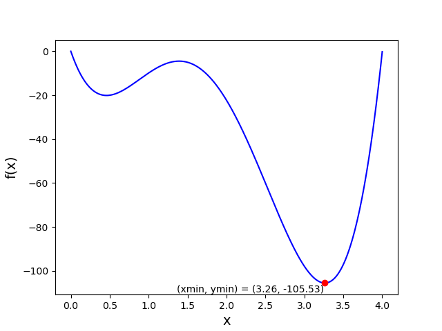

# Plot Minimum

Write a program called `plot2.py` that improves on `plot1.py` by finding and showing the minimum value of the function, like this:

## Specification

* The minimum of the function has to be calculated. Since you have a list of x-values and a list of y-values, you can easily achieve this with a `for`-loop. Write your own algorithm without using the Python functions `min()`. You might want to adapt the `max_index()` function you've written earlier to find the index of the minimum value of a list.

* Indicate the minimum of the graph by using a red dot and a text within the graph.

* Use `print` to also display the minimum as text in the terminal, in addition to the text in the graph. The minimum should be printed in the format: `(xmin, ymin) = (3.26, -105.53)`.

## Constraints

* You can import the math library and, of course, matplotlib.

* You **cannot** import any other library.

* You cannot use `.index()` to find the index of a value in a list.

## Testing

Testing for this assignment is somewhat more difficult, because checkpy cannot judge whether your graph complies with the specification. Whether it is correct or not is for you to determine. Checkpy can, however, test if you've created a graph at all.

    checkpy plot2
