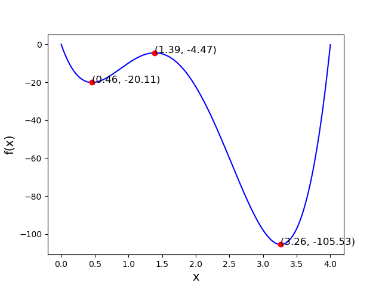
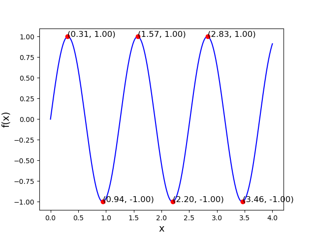

# Plot Min

Write a program called `plot_mm.py` that improves on `plot2.py` by finding all local minima and maxima. (A local minimum is a point in th function such that the closest values on both sides of that point are higher.)

Note that it should work for any function. So it should be easy to change the function without changing the functionality of the code.

## Specification

Good code design is essential for getting full marks for this assignment. It should be easy to use your code for any given function. It is up to you how to implement that, but here are some pointers:

* Make sure that the functions that are to be plotted are contained in their own python function, like this:

		def fun1(x):
		    y = 12.38 * x**4 - 84.38 * x**3 + 165.19 * x**2 - 103.05 * x + 0
		    return y

		def fun2(x):
		    y = math.sin(x*5)
		    return y

* Make sure that your code is general enough that changing from plotting one function to another is as simple as providing the right function as a parameter, like in this example:

		# change fun1 for fun2 to generate the y_values for fun2 instead
		y_values = generate_y_values(fun1, x_values)

		# plots function based on values and find and plots local minima and maxima
		plot_function(x_values, y_values)

## Constraints

* You can import the math library and, of course, matplotlib.

* You **cannot** import any other library.

## Testing

There is no checkpy for this assignment.
